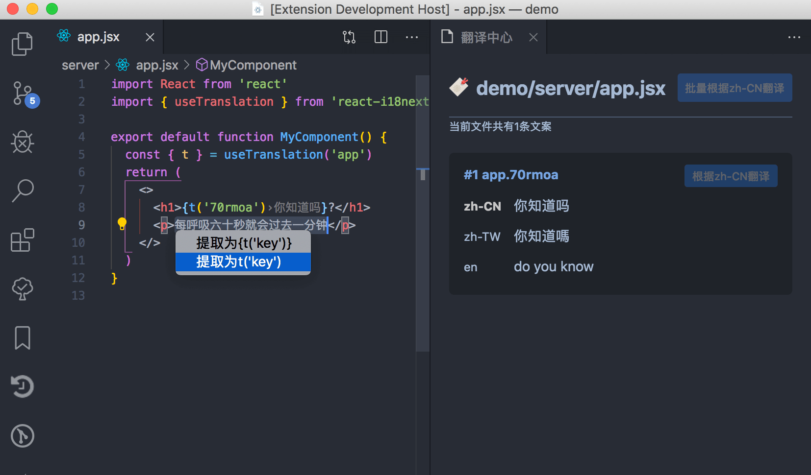
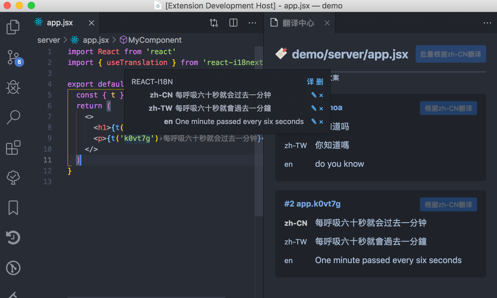
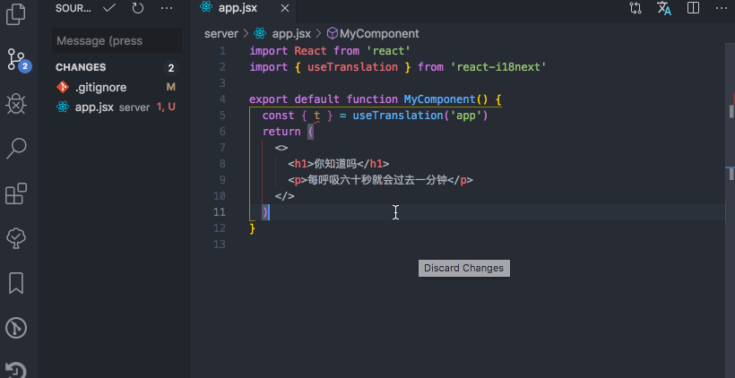
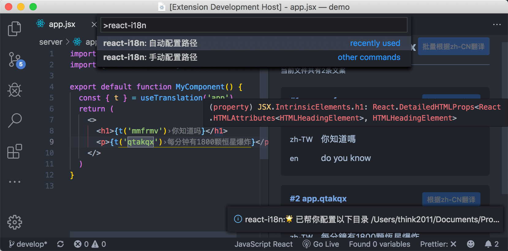

<p align="center">

</p>
<h1 align="center">vscode-react-i18n</h1>

<p align="center">
<a href="https://marketplace.visualstudio.com/items?itemName=think2011.react-i18n"></a>
<a href="https://marketplace.visualstudio.com/items?itemName=think2011.react-i18n"></a>
<a href="https://marketplace.visualstudio.com/items?itemName=think2011.react-i18n"></a>
</p>


<p align="center">
Why do you want to do this plugin? Because writing i18n is really verbose and troublesome 😫
</p>

<p align="center">
This plugin can help you easily view and write <a href="https://github.com/i18next/react-i18next">i18next</a> 🎉
</p>

<h2 align="center"> ⚡ Main functions </h2>

### Extract and automatically translate the copy (shortcut key ⌘+.)


### Intuitively see the corresponding translation copy


### Manage translations through the Translation Center



<h2 align="center"> 🦉 How to use? </h2>

### 1. First of all, your directory should be structured like this
```
  locales
  ├── en.json
  ├── zh-CN.json
  ├── zh-TW.json
  ├── ...
  └── <contry-code>.json
```

or

```
  locales
  ├── en
  | ├── common.json
  | ├── buttons.json
  | ├── ...
  | └── <filenames>.json
  ├── zh-CN
  | ├── common.json
  | ├── buttons.json
  | └── ...
  └── <contry-code>
      ├── common.json
      ├── buttons.json
      └── ...
```

### 2. Then the directory will be automatically recognized after the plugin is installed
> If not, please execute the command as shown in the figure 😝



### 3. But the component syntax is not yet supported

Like this

```js
<Translation ns="ns1"> // Can't recognize it 🙊
  {(t) => <p>{t('my translated text')}</p>}
</Translation>
```

## 📆 Function list

- [x] Translation tips
- [x] Translation notes
- [x] Translation Center
- [x] Delete multiple languages
- [x] google, youdao, baidu online translation
- [x] field completion
- [x] Automatic configuration translation directory
- [x] Manually configure translation directory
- [x] You can specify the translation source language
- [x] Duplicate, coverage detection
- [x] YAML support


## QA
> How to install?

Search for `react-i18n` in the `vscode` plugin, or click the small badge above to install it!

> Why not open Issues?

It is estimated that you have been busy for a long time and are lazy. If you encounter a problem that is **really difficult to solve** or have to~~requirement~~ **Tucao**, then send me an email< 452125301.hzplay@gmail.com>, it would be great if you can contribute PRs🙂